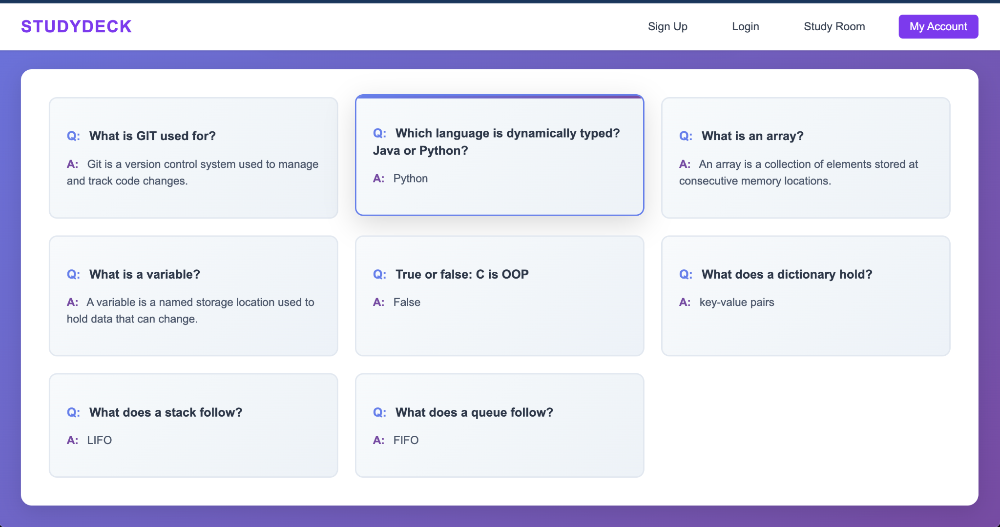
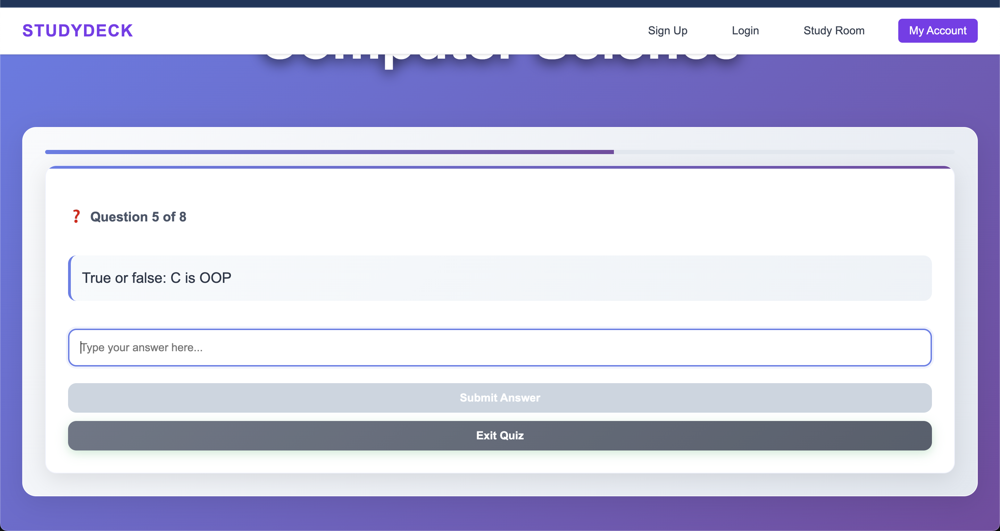
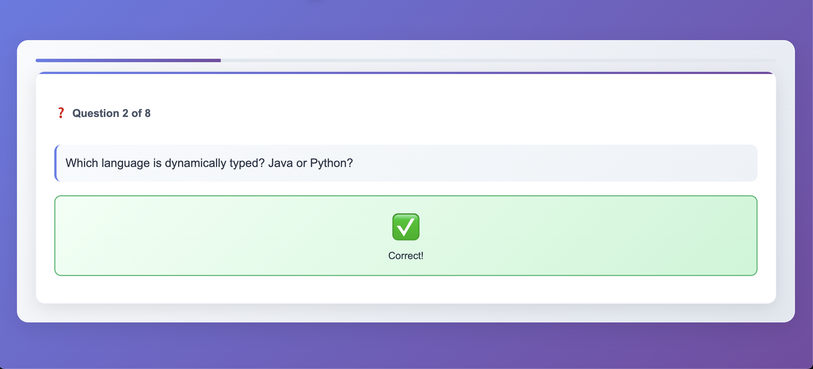
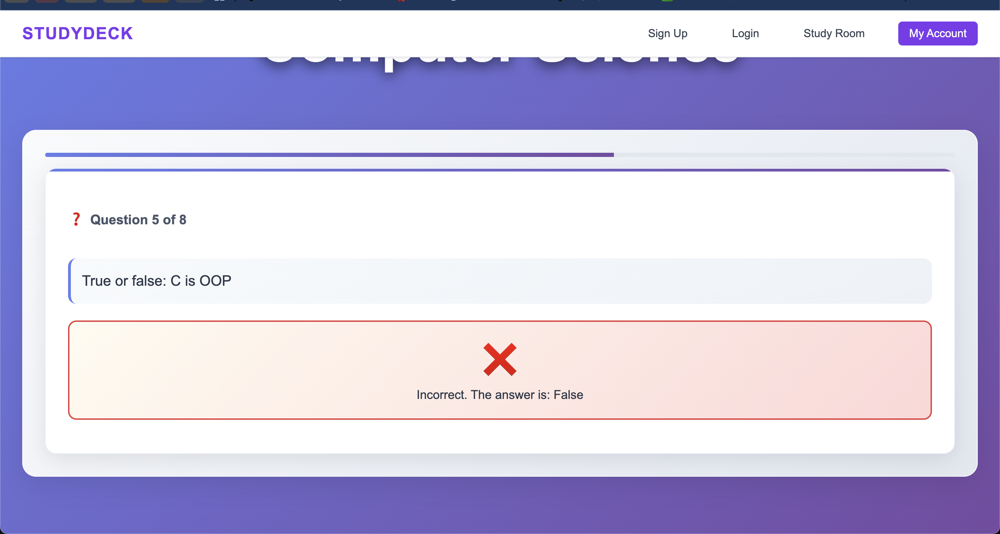
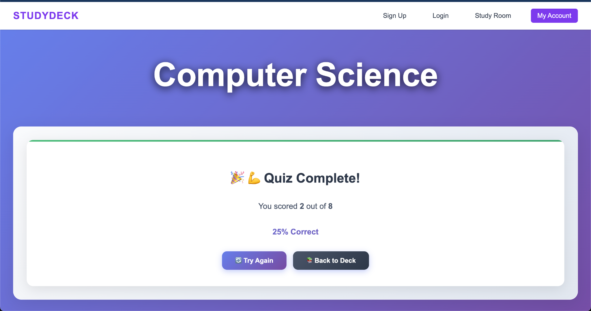

# StudyDeck 📚

**StudyDeck** is a flashcard web application that helps users create study decks, add flashcards, and practice using an interactive quiz mode. The app uses Firebase for authentication and data storage, and is deployed on AWS using S3 and CloudFront.

# Why StudyDeck?

**StudyDeck** is designed to help students study more effectively using active recall.
Unlike static notes, flashcards force learners to retrieve information from memory,
which improves long-term retention. StudyDeck provides a clean, distraction-free
interface with structured decks and quiz feedback to support consistent studying.

## Live Demo

A live deployment exists (AWS S3 + CloudFront), but the public link is intentionally not shared to avoid exposing authentication and billing-backed services.

Screenshots below demonstrate full functionality.
---

## Features

- **User Authentication**
  - Sign up, log in, log out (Firebase Authentication)
  - Secure password reset via email

- **Study Decks**
  - Create and view decks for different subjects
  - Add flashcards (question + answer)

- **Quiz Mode**
  - Practice flashcards one by one
  - Immediate feedback (correct / incorrect)
  - Final score and percentage at the end

- **Study Settings**
  - Toggle: *Show answer after incorrect*

- **Account Management**
  - Update profile information
  - Send password reset email

### Coming Soon
- Study streak tracking  
- Email notifications  

---

## Tech Stack

### Frontend
- React (Create React App)
- React Router

### Backend / Database
- Firebase Authentication
- Firebase Firestore

### Deployment (AWS)
- Amazon S3 (static hosting)
- Amazon CloudFront (CDN + HTTPS)
- CloudFront custom error responses for SPA routing
- AWS WAF (monitor mode)

---

## Screenshots

### Deck Overview

### Quiz Mode

### Correct Answer Feedback

### Incorrect Answer Feedback

### Quiz Results

## Architecture Overview

- The frontend is a single-page React application using React Router.
- Firebase Authentication handles user sign-in, sign-up, and password resets.
- User data, decks, and flashcards are stored in Firebase Firestore.
- The production build is hosted on Amazon S3 and delivered globally using CloudFront.
- CloudFront custom error responses are used to support client-side routing.

## Future Improvements

- Implement accurate study streak tracking based on completed study sessions.
- Add scheduled email notifications for study reminders.
- Improve quiz analytics and progress tracking.
- Add spaced repetition support.

## Contact

If you’d like to connect or have questions about this project:

- **GitHub:** https://github.com/shanzayc
- **LinkedIn:** https://www.linkedin.com/in/shanzaychaudhry/
- **Email:** shanzayc@outlook.com

Feel free to reach out!
